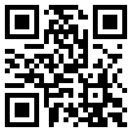
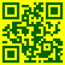

# QRCodeLite

A super-lightweight basic QR code image generator in pure Swift for all Swift platforms.

If you want more control and style when generating a QR Code on your Apple device, try [QRCode](https://github.com/dagronf/QRCode).

## tl;dr Just show me!

### Super simple!

A traditional, simple black and white QR Code

```swift
let qrcode = try QRLCode.generate(
   format: .ppm, 
   text: "My QR Code!!", 
   modulePixelSize: 8
)
```

<a href="./art/doco1.png">
   
</a>


### Colors!

```swift
let qrcode = try QRLCode.generate(
   format: .svg,
   text: "This is a test",
   modulePixelSize: 4,
   foregroundColor: .rgb(0, 100, 0),
   backgroundColor: .yellow
)
```

<a href="./art/doco2.svg">
   
</a>

## Export types

| Type            | Description                   |
|:----------------|:------------------------------|
| `.svg`          | Scalable Vector Graphics      |
| `.bmp`          | Uncompressed BMP format       |
| `.ppm`          | PPMv6 bitmap file             |
| `.ascii`        | ASCII representation          |
| `.smallAscii`   | Compact ASCII representation  |

## API

### Generate a QRCode image

```swift
/// Generate a QR Code
/// - Parameters:
///   - format: The export format (eg. svg, ppm etc)
///   - text: The text to encode
///   - errorCorrection: The error correction level
///   - modulePixelSize: For image-based exports, the dimension of each module (square) in pixels
///   - quietModules: The number of quiet modules to include around the outside of the export image
///   - foregroundColor: The foreground color
///   - backgroundColor: The background color, or nil for transparency (if the export format supports it)
/// - Returns: The generated qr code information
public static func generate(
   format: QRLCode.ExportType,
   text: String,
   errorCorrection: QRCodeECC = .high,
   modulePixelSize: Int = 3,
   quietModules: UInt = 1,
   foregroundColor: RGB = .black,
   backgroundColor: RGB? = .white
) throws -> QRLCode.Result
```

`QRLCode.Result` contains the resulting image data and its pixel dimensions.


### Generate raw QR Code data

```swift
/// Return the raw QR Code representation
/// - Parameters:
///   - text: The text to encode
///   - errorCorrection: The error correction level
/// - Returns: A bool matrix containing the raw QR code information
public static func generateRaw(
   text: String,
   errorCorrection: QRCodeECC = .high
) throws -> BoolMatrix
```

## License

```
MIT License

Copyright (c) 2024 Darren Ford

Permission is hereby granted, free of charge, to any person obtaining a copy
of this software and associated documentation files (the "Software"), to deal
in the Software without restriction, including without limitation the rights
to use, copy, modify, merge, publish, distribute, sublicense, and/or sell
copies of the Software, and to permit persons to whom the Software is
furnished to do so, subject to the following conditions:

The above copyright notice and this permission notice shall be included in all
copies or substantial portions of the Software.

THE SOFTWARE IS PROVIDED "AS IS", WITHOUT WARRANTY OF ANY KIND, EXPRESS OR
IMPLIED, INCLUDING BUT NOT LIMITED TO THE WARRANTIES OF MERCHANTABILITY,
FITNESS FOR A PARTICULAR PURPOSE AND NONINFRINGEMENT. IN NO EVENT SHALL THE
AUTHORS OR COPYRIGHT HOLDERS BE LIABLE FOR ANY CLAIM, DAMAGES OR OTHER
LIABILITY, WHETHER IN AN ACTION OF CONTRACT, TORT OR OTHERWISE, ARISING FROM,
OUT OF OR IN CONNECTION WITH THE SOFTWARE OR THE USE OR OTHER DEALINGS IN THE
SOFTWARE.
```

### [swift-qrcode-generator](https://github.com/fwcd/swift-qrcode-generator)

```
MIT License

Copyright (c) Project Nayuki. (MIT License)
Copyright (c) 2020 fwcd

Permission is hereby granted, free of charge, to any person obtaining a copy
of this software and associated documentation files (the "Software"), to deal
in the Software without restriction, including without limitation the rights
to use, copy, modify, merge, publish, distribute, sublicense, and/or sell
copies of the Software, and to permit persons to whom the Software is
furnished to do so, subject to the following conditions:

The above copyright notice and this permission notice shall be included in all
copies or substantial portions of the Software.

THE SOFTWARE IS PROVIDED "AS IS", WITHOUT WARRANTY OF ANY KIND, EXPRESS OR
IMPLIED, INCLUDING BUT NOT LIMITED TO THE WARRANTIES OF MERCHANTABILITY,
FITNESS FOR A PARTICULAR PURPOSE AND NONINFRINGEMENT. IN NO EVENT SHALL THE
AUTHORS OR COPYRIGHT HOLDERS BE LIABLE FOR ANY CLAIM, DAMAGES OR OTHER
LIABILITY, WHETHER IN AN ACTION OF CONTRACT, TORT OR OTHERWISE, ARISING FROM,
OUT OF OR IN CONNECTION WITH THE SOFTWARE OR THE USE OR OTHER DEALINGS IN THE
SOFTWARE.
```
